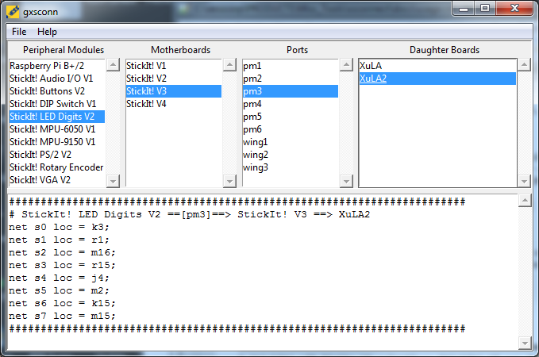

========
Usage
========

To use xsconnect in a project::

    import xsconnect

But you're probably not interested in that.
You really want to use the scripts that will generate
the pin assignments for a given combination
of peripheral, mother and daughter boards.

Command-Line Tool
=================

``xsconn`` is the command-line script for generating pin assignments::

    usage: xsconn.py [-h] [-v] [-p [PERIPHERALBOARD]] [-m [MOTHERBOARD]]
                     [-d [DAUGHTERBOARD]] [-n [PORTNAME]] [-l]

    Generate pin assignments for a given peripheral board, motherboard, and
    daughterboard.

    optional arguments:
      -h, --help            show this help message and exit
      -v, --version         show program's version number and exit
      -p [PERIPHERALBOARD], --peripheralboard [PERIPHERALBOARD]
      -m [MOTHERBOARD], --motherboard [MOTHERBOARD]
      -d [DAUGHTERBOARD], --daughterboard [DAUGHTERBOARD]
      -n [PORTNAME], --portname [PORTNAME]
      -l, --list
      
For example, if a StickIt! LEDDigits peripheral board is connected to
the PM3 port of a StickIt! V3 motherboard which in turn holds a XuLA2
FPGA board, then the command::

    xsconn -p leddigits -m stickit3 -n pm3 -d xula2
    
will generate the output::

    ########################################################################
    # StickIt! LED Digits V2 ==[pm3]==> StickIt! V3 ==> XuLA2
    net s0 loc = k3;
    net s1 loc = r1;
    net s2 loc = m16;
    net s3 loc = r15;
    net s4 loc = j4;
    net s5 loc = m2;
    net s6 loc = k15;
    net s7 loc = m15;
    ########################################################################
    
This lists the input nets of the LED board and the pins of the FPGA
on the XuLA2 to which they are connected in a format suitable for inclusion
in a *user-constraints file* used by the FPGA development tools.

*Note*: Use the ``xsconn -l`` command to get a list of all the possible peripheral
boards, motherboards, and daughterboards that are currently supported.

**Note**: Fuzzy string matching is used on the arguments
so you don't have to type the exact names of the boards: ``xsconn``
will make a *best guess* about what you mean.
But it may guess wrong if you provide only a small part of a board name, 
so it always makes sense to check the top line
of the output to see how ``xsconn`` resolved your inputs.  
  
  
GUI Tool
=================

``gxsconn`` is the GUI version of ``xsconn``.
All you need to do is highlight the various boards you are connecting
and the associated pin assignments will immediately appear in the lower pane of the window.
The pin assignments can be cut-and-pasted or saved directly to a file.

